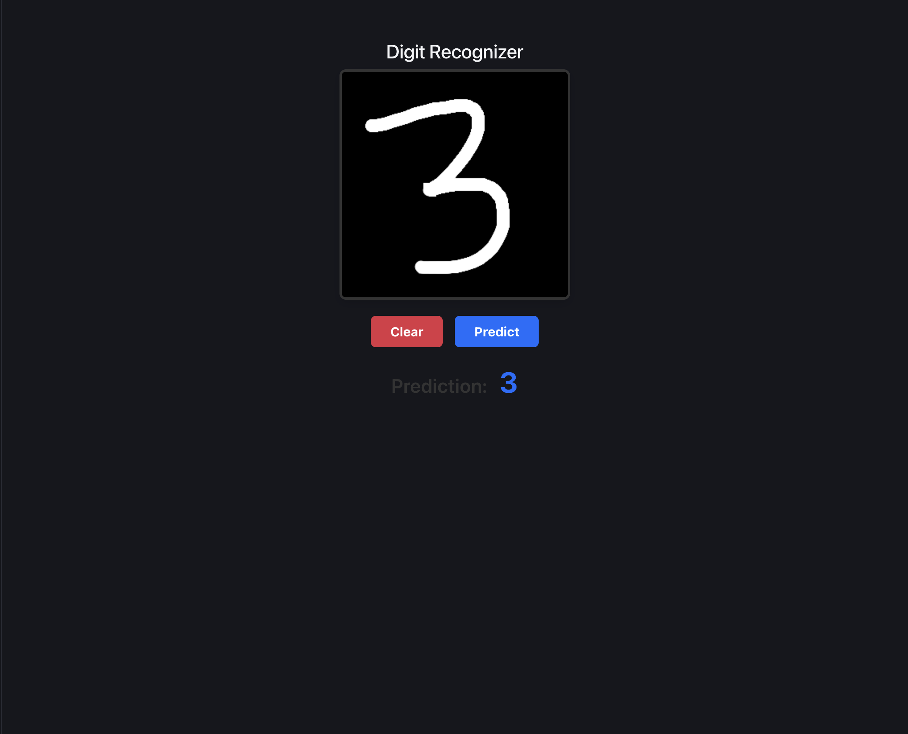
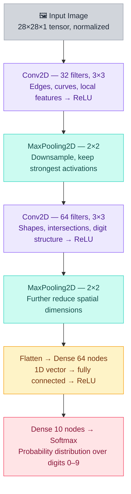

# 🧠 Handwritten Digit Recognizer

A web app where you draw a digit and a trained CNN tells you what it is.



---

## ✨ Features

- **Draw & Predict** — Sketch any digit (0–9) on an HTML5 canvas and get an instant prediction
- **Custom CNN** — A LeNet-5-inspired model trained on 60,000 MNIST images
- **Full-Stack** — React frontend communicates with a Flask REST API serving the TensorFlow model
- **Probability Output** — Returns the full softmax distribution, not just the top guess

---

## 🏗️ Tech Stack

| Layer | Technology |
|---|---|
| Frontend | React, Vite |
| Backend | Python, Flask, Flask-CORS |
| ML Framework | TensorFlow / Keras |
| Dataset | MNIST (60,000 training images) |

---

## 🧠 How It Works

### 1. Drawing → Preprocessing

The React canvas captures your drawing as raw RGBA pixel data. Before sending it to the API, the frontend:
- Scales the image down to **28×28 pixels**
- Isolates the **grayscale brightness** channel
- Flattens it into a **1D array of 784 values**

### 2. API → Tensor

Flask receives the pixel array and:
- Reshapes it into a `(1, 28, 28, 1)` tensor
- Normalizes pixel values to the `[0, 1]` range

### 3. CNN Architecture

```

```

### 4. Prediction → Response

The model outputs a 10-element probability vector. The API returns the `argmax` (most likely digit) to the frontend.

---

## 🚀 Getting Started

You'll need **two terminal windows** — one for the backend, one for the frontend.

### Prerequisites

- Python 3.8+
- Node.js 16+

### Backend (Terminal 1)

```bash
# Clone the repository
git clone https://github.com/druvetron/digit-recognizer-cnn.git
cd digit-recognizer-cnn

# Install Python dependencies
pip install tensorflow flask flask-cors numpy

# Start the Flask server (http://127.0.0.1:5000)
python app.py
```

### Frontend (Terminal 2)

```bash
cd client

# Install Node dependencies
npm install

# Start the Vite dev server (http://localhost:5173)
npm run dev
```

Open [http://localhost:5173](http://localhost:5173) in your browser, draw a digit, and hit **Predict**.

---

## 📁 Project Structure

```
digit-recognizer-cnn/
├── app.py               # Flask API — loads model, handles /predict endpoint
├── train.py             # Model definition & MNIST training script
├── model/
│   └── digit_model.h5   # Saved Keras model weights
└── client/
    ├── src/
    │   ├── App.jsx       # Main component with canvas + prediction display
    │   └── Canvas.jsx    # Drawing logic & pixel extraction
    └── vite.config.js
```

---

## 🔌 API Reference

### `POST /predict`

Accepts a flattened pixel array and returns the predicted digit.

**Request body:**
```json
{
  "pixels": [0.0, 0.12, 0.95, ...]  // 784 normalized float values
}
```

**Response:**
```json
{
  "prediction": 7,
  "probabilities": [0.001, 0.002, 0.01, ..., 0.94, ...]
}
```

---

## 🤝 Contributing

Pull requests are welcome. For major changes, please open an issue first to discuss what you'd like to change.

---

## 📄 License

[MIT](./LICENSE)